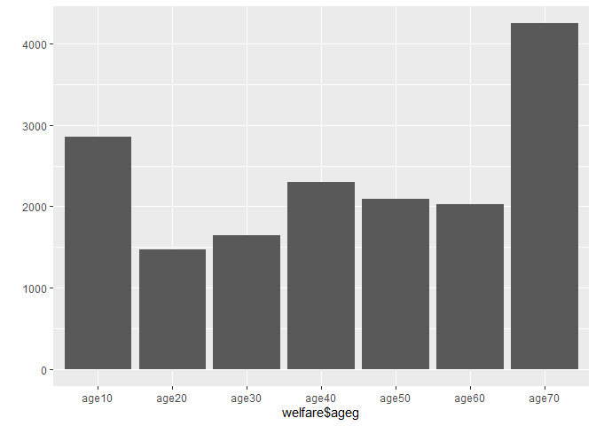
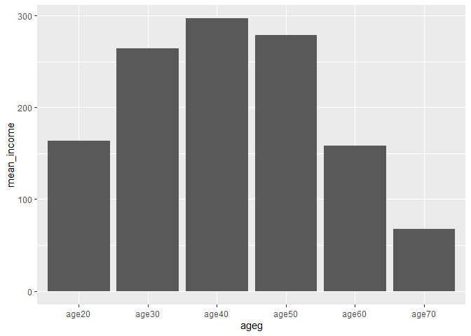

연령대에 따른 월급차이 (10대/20대/30대/40대/50대/60대/70대 이상)
================
김근아
July 31, 2020

## 2\. 연령대에 따른 월급차이 (10대/20대/30대/40대/50대/60대/70대 이상)

### 데이터 분석 절차

#### 1\. 변수 검토하기

``` r
table(welfare$ageg)

qplot(welfare$ageg)
```

<!-- -->

``` r
summary(welfare$income)
```

#### 2\. 전처리

``` r
welfare$income <- ifelse(welfare$income %in% c(0,9999), NA, welfare$income)

table(is.na(welfare$income))
```

### 나이와 월급의 관계 분석하기

#### 1\. 나이에 따른 월급 평균표 만들기

``` r
ageg_income <- welfare %>% 
  filter(!is.na(income)) %>% 
  group_by(ageg) %>% 
  summarise(mean_income = mean(income))
```

    ## `summarise()` ungrouping output (override with `.groups` argument)

``` r
ageg_income
```

#### 2\. 그래프 만들기

``` r
ggplot(data = ageg_income, aes(x= ageg, y=mean_income))+geom_col()
```

<!-- -->
