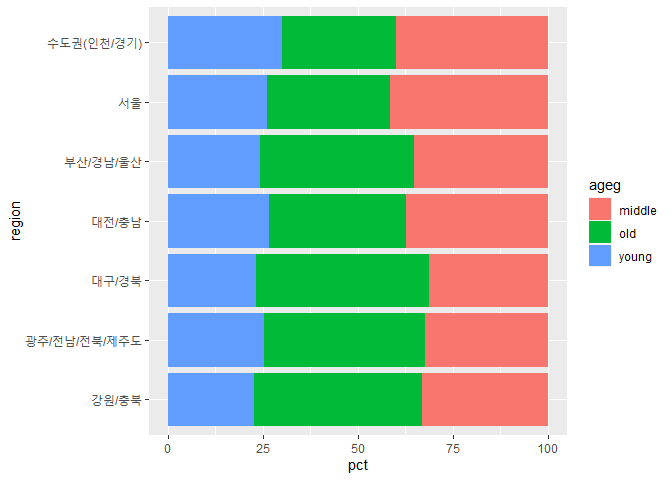

지역별 연령대 비율
================
김근아
July 31, 2020

## 2\. 지역별 연령대 비율 분석하기

### 데이터 분석 절차

#### 1\. 변수 검토하기

``` r
class(welfare$code_region)

table(welfare$code_region)
```

#### 2\. 전처리

``` r
list_region <- data.frame(code_region = c(1:7),
                          region = c("서울",
                                     "수도권(인천/경기)",
                                     "부산/경남/울산",
                                     "대구/경북",
                                     "대전/충남",
                                     "강원/충북",
                                     "광주/전남/전북/제주도"))

list_region

# 지역별 변수 추가

welfare <- left_join(welfare,list_region, id="code_region")
```

    ## Joining, by = "code_region"

``` r
welfare %>% 
  select(code_region, region) %>% 
  head


# 지역별 연령대 비율표 만들기

region_ageg <- welfare %>% 
  group_by(region,ageg) %>% 
  summarise(n=n()) %>% 
  mutate(tot_group = sum(n)) %>% 
  mutate(pct = round(n/tot_group*100,2))
```

    ## `summarise()` regrouping output by 'region' (override with `.groups` argument)

``` r
region_ageg
```

### 지역별 연령대 비율 분석하기

#### 1\. 그래프 만들기

``` r
ggplot(data = region_ageg, aes(x=region, y=pct, fill=ageg)) + 
  geom_col() + coord_flip()
```

<!-- -->
