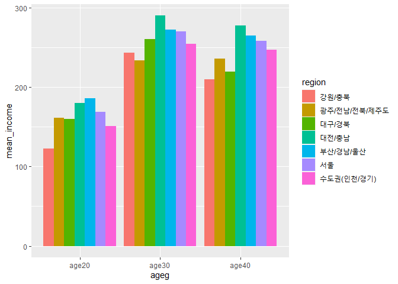

도시별 20대 30대 40대 이상 월급분석하기
================
김근아
July 31, 2020

## 2\. 나이 별 급여

### 데이터 분석 절차

#### 1\. 변수 검토하기

``` r
class(welfare$ageg)

table(welfare$ageg)

class(welfare$code_region)

table(welfare$code_region)
```

#### 2\. 전처리

``` r
list_region <- data.frame(code_region = c(1:7),
                          region = c("서울",
                                     "수도권(인천/경기)",
                                     "부산/경남/울산",
                                     "대구/경북",
                                     "대전/충남",
                                     "강원/충북",
                                     "광주/전남/전북/제주도"))

list_region

# 지역별 변수 추가

welfare <- left_join(welfare,list_region, id="code_region")
```

    ## Joining, by = "code_region"

``` r
welfare %>% 
  select(code_region, region) %>% 
  head
```

### 연령대 및 도시별 월급분석하기

#### 1\. 연령대 및 도시 월급 평균표 만들기

``` r
ageg_income <- welfare %>% 
  filter(!is.na(income)) %>% 
  group_by(ageg, region) %>% 
  summarise(mean_income = mean(income))
```

    ## `summarise()` regrouping output by 'ageg' (override with `.groups` argument)

``` r
ageg_income
```

#### 2\. 그래프 만들기

``` r
ggplot(data = ageg_income, aes(x = ageg, y = mean_income, fill = region)) +
  geom_col(position = "dodge")
```

<!-- --> \*\*\*
결론 : 20대 : 부산/경남/울산의 월급이 높고, 강원/충북의 월급이 낮다 \*\*\* 30대 : 대전/충남 의 월급이 높고,
광주/전남/전북/제주도가 제일 낮다 40대이상 : 대전/충남의 월급이 높고, 강원/충북의 월급이 낮다.
